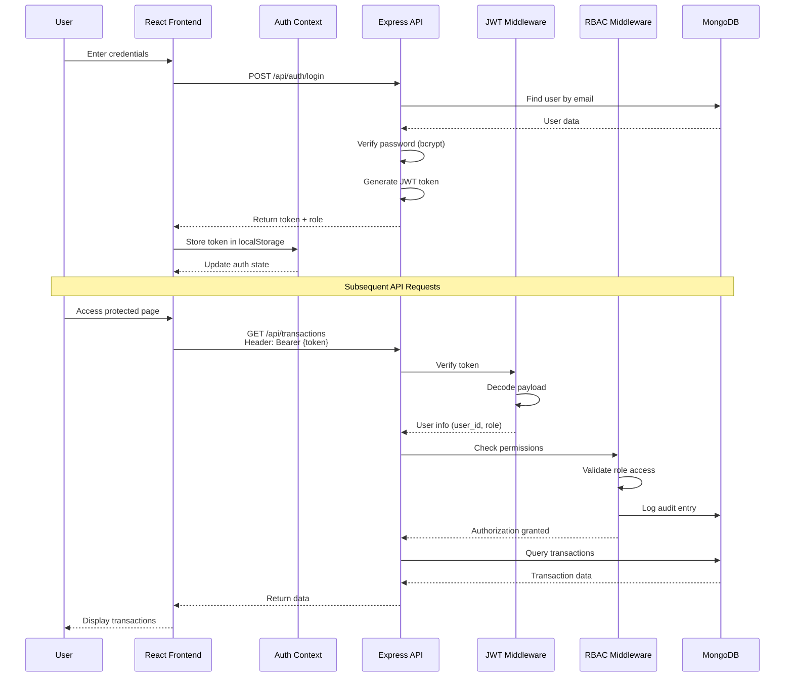
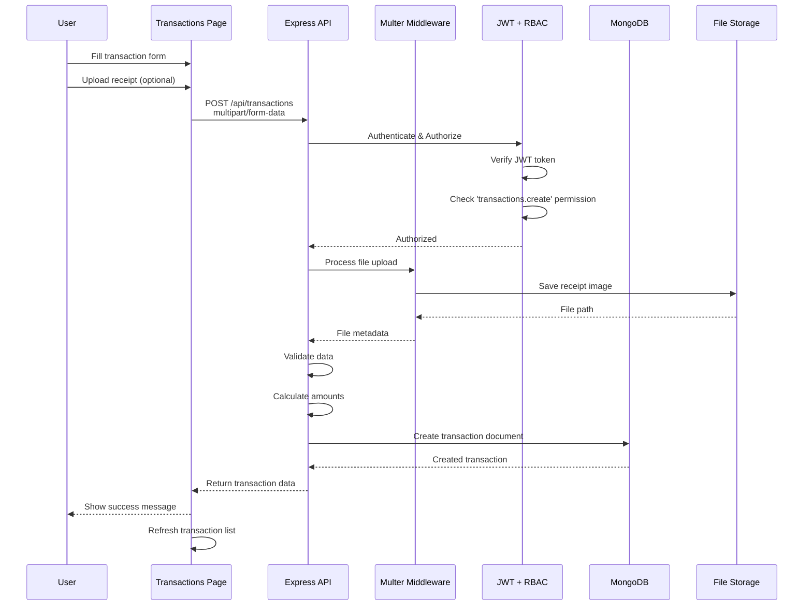
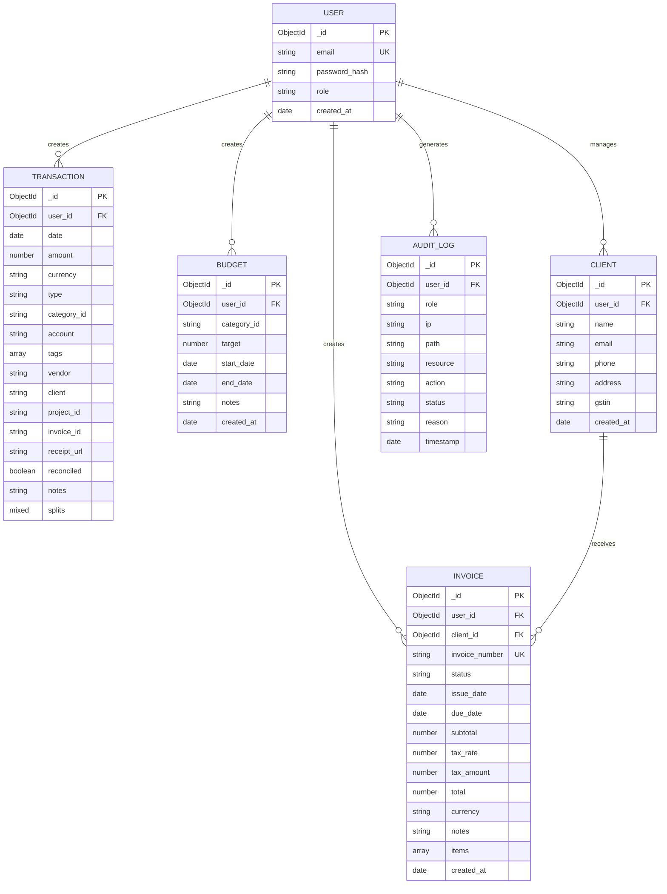
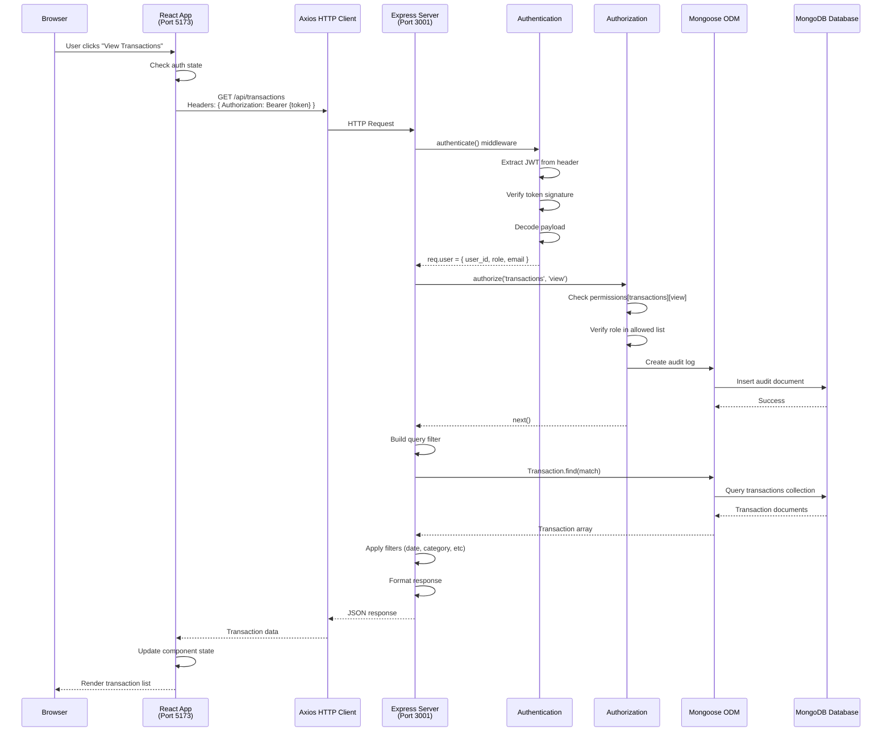
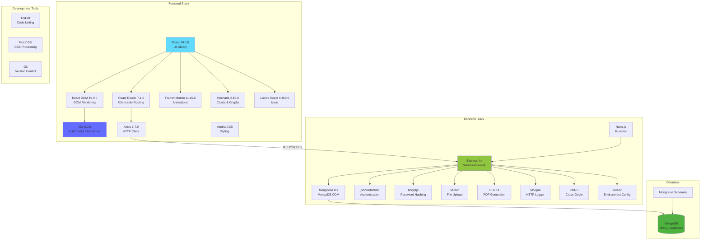
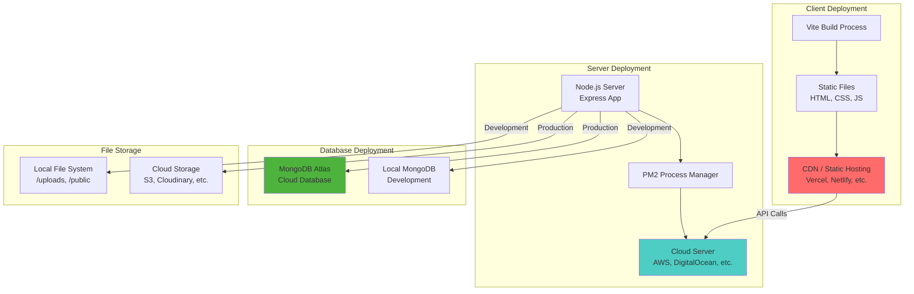

```mermaid
graph LR
    subgraph "Frontend Components"
        Login[Login Page]
        Register[Register Page]
        Dashboard[Dashboard Pages]
        TransPage[Transactions Pages]
        BudgetPage[Budgets Pages]
        ClientPage[Clients Pages]
        InvoicePage[Invoices Pages]
    end
    
    subgraph "API Endpoints - Express Server"
        subgraph "Authentication /api/auth"
            PostRegister[POST /register]
            PostLogin[POST /login]
            GetMe[GET /me]
        end
        
        subgraph "Transactions /api/transactions"
            GetTrans[GET /]
            PostTrans[POST /]
            PutTrans[PUT /:id]
            DelTrans[DELETE /:id]
            ExportCSV[GET /export.csv]
            ImportCSV[POST /import.csv]
        end
        
        subgraph "Budgets /api/budgets"
            GetBudget[GET /]
            PostBudget[POST /]
            PutBudget[PUT /:id]
            DelBudget[DELETE /:id]
        end
        
        subgraph "Clients /api/clients"
            GetClient[GET /]
            GetClientID[GET /:id]
            PostClient[POST /]
            PutClient[PUT /:id]
            DelClient[DELETE /:id]
        end
        
        subgraph "Invoices /api/invoices"
            GetInvoice[GET /]
            GetInvoiceID[GET /:id]
            PostInvoice[POST /]
            PutInvoice[PUT /:id]
            DelInvoice[DELETE /:id]
        end
        
        subgraph "Dashboard /api/dashboard"
            GetDash[GET /]
        end
        
        subgraph "Utilities"
            GetCategories[GET /api/categories]
            GetAccounts[GET /api/accounts]
            GetAudit[GET /api/audit]
        end
    end
    
    subgraph "MongoDB Collections"
        UserDB[(Users)]
        TransDB[(Transactions)]
        BudgetDB[(Budgets)]
        ClientDB[(Clients)]
        InvoiceDB[(Invoices)]
        AuditDB[(Audit Logs)]
    end
    
    Login -->|POST| PostLogin
    Register -->|POST| PostRegister
    Dashboard -->|GET| GetMe
    Dashboard -->|GET| GetDash
    Dashboard -->|GET| GetCategories
    
    TransPage -->|GET| GetTrans
    TransPage -->|POST| PostTrans
    TransPage -->|PUT| PutTrans
    TransPage -->|DELETE| DelTrans
    TransPage -->|GET| ExportCSV
    TransPage -->|POST| ImportCSV
    
    BudgetPage -->|GET| GetBudget
    BudgetPage -->|POST| PostBudget
    BudgetPage -->|PUT| PutBudget
    BudgetPage -->|DELETE| DelBudget
    
    ClientPage -->|GET| GetClient
    ClientPage -->|GET| GetClientID
    ClientPage -->|POST| PostClient
    ClientPage -->|PUT| PutClient
    ClientPage -->|DELETE| DelClient
    
    InvoicePage -->|GET| GetInvoice
    InvoicePage -->|GET| GetInvoiceID
    InvoicePage -->|POST| PostInvoice
    InvoicePage -->|PUT| PutInvoice
    InvoicePage -->|DELETE| DelInvoice
    
    PostRegister --> UserDB
    PostLogin --> UserDB
    GetMe --> UserDB
    
    GetTrans --> TransDB
    PostTrans --> TransDB
    PutTrans --> TransDB
    DelTrans --> TransDB
    ExportCSV --> TransDB
    ImportCSV --> TransDB
    
    GetBudget --> BudgetDB
    PostBudget --> BudgetDB
    PutBudget --> BudgetDB
    DelBudget --> BudgetDB
    
    GetClient --> ClientDB
    GetClientID --> ClientDB
    PostClient --> ClientDB
    PutClient --> ClientDB
    DelClient --> ClientDB
    
    GetInvoice --> InvoiceDB
    GetInvoiceID --> InvoiceDB
    PostInvoice --> InvoiceDB
    PutInvoice --> InvoiceDB
    DelInvoice --> InvoiceDB
    
    GetDash --> TransDB
    GetDash --> BudgetDB
    
    GetAudit --> AuditDB
    
    style Login fill:#ffd700
    style Register fill:#ffd700
    style Dashboard fill:#87ceeb
    style TransPage fill:#87ceeb
    style BudgetPage fill:#87ceeb
    style ClientPage fill:#87ceeb
    style InvoicePage fill:#87ceeb
```

```mermaid
graph TD
    subgraph "User Roles"
        Admin[Admin<br/>Full Access]
        ClientMgmt[Client Management<br/>Enterprise Features]
        SelfEmp[Self-Employed<br/>Business + Personal]
        Salary[Salary Person<br/>Personal Finance]
        Accountant[Accountant<br/>Read-Only + Reports]
        Viewer[Viewer<br/>Read-Only]
    end
    
    subgraph "Resources & Permissions"
        Dashboard[Dashboard: view]
        Trans[Transactions: view, create, update, delete, export, import]
        Budget[Budgets: view, create, update, delete]
        Client[Clients: view, detail, create, update, delete]
        Invoice[Invoices: view, detail, create, update, delete]
        Audit[Audit Logs: view]
    end
    
    Admin -->|All| Dashboard
    Admin -->|All| Trans
    Admin -->|All| Budget
    Admin -->|All| Client
    Admin -->|All| Invoice
    Admin -->|All| Audit
    
    ClientMgmt -->|view| Dashboard
    ClientMgmt -->|view, create, update, export, import| Trans
    ClientMgmt -->|view, create, update| Budget
    ClientMgmt -->|All except delete| Client
    ClientMgmt -->|All except delete| Invoice
    
    SelfEmp -->|view| Dashboard
    SelfEmp -->|view, create, update, export, import| Trans
    SelfEmp -->|view, create, update| Budget
    SelfEmp -->|All except delete| Client
    SelfEmp -->|All except delete| Invoice
    
    Salary -->|view| Dashboard
    Salary -->|view, create, update, export, import| Trans
    Salary -->|view, create, update| Budget
    
    Accountant -->|view| Dashboard
    Accountant -->|view, export| Trans
    Accountant -->|view| Budget
    Accountant -->|view, detail| Client
    Accountant -->|view, detail| Invoice
    
    Viewer -->|view| Dashboard
    Viewer -->|view| Trans
    Viewer -->|view| Budget
    
    style Admin fill:#ff6b6b
    style ClientMgmt fill:#4ecdc4
    style SelfEmp fill:#ffe66d
    style Salary fill:#95e1d3
    style Accountant fill:#a8e6cf
    style Viewer fill:#dfe6e9
```

```mermaid
graph TD
    App[App.jsx<br/>Router Setup]
    
    subgraph "Authentication"
        AuthLayout[Auth Layout]
        Login[Login Page]
        Register[Register Page]
    end
    
    subgraph "Salary Persona"
        SalaryLayout[Salary Layout<br/>Dark Theme]
        SalaryDash[Dashboard]
        SalaryTrans[Transactions]
        SalaryBudget[Budgets]
    end
    
    subgraph "Enterprise Persona"
        EntLayout[Enterprise Layout<br/>Professional Theme]
        EntDash[Dashboard]
        EntClients[Clients]
        EntInvoices[Invoices]
        EntReports[Reports]
    end
    
    subgraph "Self-Employed Persona"
        SelfLayout[Self-Employed Layout<br/>Warm Theme]
        SelfDash[Dashboard]
        SelfBusiness[Business]
        SelfFinances[Finances]
    end
    
    subgraph "Shared Components"
        Button[Button]
        Input[Input]
        Modal[Modal]
        NavLink[NavLink]
        Skeleton[Skeleton]
        Tabs[Tabs]
    end
    
    subgraph "Context"
        AuthContext[Auth Context<br/>JWT Token Management]
    end
    
    App --> AuthContext
    App --> AuthLayout
    App --> SalaryLayout
    App --> EntLayout
    App --> SelfLayout
    
    AuthLayout --> Login
    AuthLayout --> Register
    
    SalaryLayout --> SalaryDash
    SalaryLayout --> SalaryTrans
    SalaryLayout --> SalaryBudget
    
    EntLayout --> EntDash
    EntLayout --> EntClients
    EntLayout --> EntInvoices
    EntLayout --> EntReports
    
    SelfLayout --> SelfDash
    SelfLayout --> SelfBusiness
    SelfLayout --> SelfFinances
    
    Login --> Button
    Login --> Input
    Register --> Button
    Register --> Input
    
    SalaryDash --> Button
    SalaryDash --> Modal
    SalaryTrans --> Modal
    SalaryTrans --> Tabs
    
    EntClients --> Modal
    EntClients --> Button
    EntInvoices --> Modal
    
    SelfBusiness --> Modal
    SelfFinances --> Button
    
    AuthContext -.->|Provides Auth State| App
    
    style App fill:#61dafb
    style AuthContext fill:#ffd700
```

# BudgetFlow - System Design Architecture

This document contains Mermaid diagrams showing the complete system architecture, API connections, and data flow for the MERN stack application.

---

## 🏗️ High-Level System Architecture

```mermaid
graph TB
    subgraph "Client Layer - React Frontend"
        Browser[Web Browser]
        React[React 19 + Vite]
        Router[React Router]
        Auth[Auth Context]
        
        subgraph "UI Personas"
            Salary[Salary Persona<br/>Dark Theme]
            Enterprise[Enterprise Persona<br/>Professional Theme]
            SelfEmployed[Self-Employed Persona<br/>Warm Theme]
        end
        
        subgraph "Components"
            Pages[Pages]
            Layouts[Layouts]
            UIComponents[UI Components]
        end
    end
    
    subgraph "Server Layer - Node.js Backend"
        Express[Express Server<br/>Port 3001]
        JWT[JWT Authentication]
        RBAC[Role-Based Access Control]
        Multer[Multer File Upload]
        
        subgraph "API Routes"
            AuthAPI[Auth API]
            TransAPI[Transactions API]
            BudgetAPI[Budgets API]
            ClientAPI[Clients API]
            InvoiceAPI[Invoices API]
            DashAPI[Dashboard API]
            AuditAPI[Audit API]
        end
    end
    
    subgraph "Database Layer"
        MongoDB[(MongoDB)]
        
        subgraph "Collections"
            Users[Users Collection]
            Transactions[Transactions Collection]
            Budgets[Budgets Collection]
            Clients[Clients Collection]
            Invoices[Invoices Collection]
            Audits[Audit Logs Collection]
        end
    end
    
    subgraph "File Storage"
        Uploads[/uploads/<br/>Receipt Images]
        Public[/public/<br/>Generated PDFs]
    end
    
    Browser --> React
    React --> Router
    Router --> Auth
    Auth --> Salary
    Auth --> Enterprise
    Auth --> SelfEmployed
    
    Salary --> Pages
    Enterprise --> Pages
    SelfEmployed --> Pages
    Pages --> Layouts
    Layouts --> UIComponents
    
    React -->|HTTP/HTTPS| Express
    Express --> JWT
    JWT --> RBAC
    Express --> Multer
    
    AuthAPI --> Users
    TransAPI --> Transactions
    BudgetAPI --> Budgets
    ClientAPI --> Clients
    InvoiceAPI --> Invoices
    DashAPI --> Transactions
    DashAPI --> Budgets
    AuditAPI --> Audits
    
    Express --> MongoDB
    Multer --> Uploads
    Express --> Public
    
    style React fill:#61dafb,stroke:#000,stroke-width:2px
    style Express fill:#90c53f,stroke:#000,stroke-width:2px
    style MongoDB fill:#4db33d,stroke:#000,stroke-width:2px
```

---

## 🔌 API Endpoints & Connections



---

## 🔐 Authentication & Authorization Flow



---

## 📊 Data Flow - Transaction Creation



---

## 🎭 Role-Based Access Control (RBAC)



---

## 🗄️ Database Schema Relationships



---

## 🎨 Frontend Component Hierarchy



---

## 🔄 Complete Request-Response Cycle



---

## 📦 Technology Stack Details



---

## 🚀 Deployment Architecture



---

## 📝 Summary

### **Frontend (React)**
- **Port**: 5173 (development)
- **Framework**: React 19 + Vite
- **Routing**: React Router
- **State Management**: Context API (Auth)
- **Styling**: Vanilla CSS with custom properties
- **HTTP Client**: Axios

### **Backend (Node.js + Express)**
- **Port**: 3001
- **Framework**: Express 4.x
- **Authentication**: JWT (jsonwebtoken)
- **Authorization**: Custom RBAC middleware
- **File Upload**: Multer
- **Password Security**: bcryptjs

### **Database (MongoDB)**
- **Type**: NoSQL Document Database
- **ODM**: Mongoose
- **Collections**: Users, Transactions, Budgets, Clients, Invoices, Audit Logs

### **API Endpoints**
- **Authentication**: `/api/auth/*`
- **Transactions**: `/api/transactions/*`
- **Budgets**: `/api/budgets/*`
- **Clients**: `/api/clients/*`
- **Invoices**: `/api/invoices/*`
- **Dashboard**: `/api/dashboard`
- **Utilities**: `/api/categories`, `/api/accounts`, `/api/audit`

### **Security Features**
- JWT-based authentication
- Role-based access control (6 roles)
- Password hashing with bcrypt
- Audit logging for all actions
- CORS protection
- Input validation

---

**Last Updated**: November 2025
